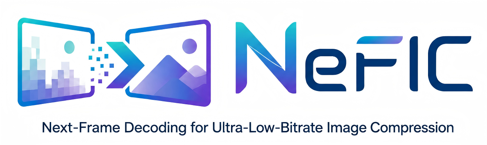

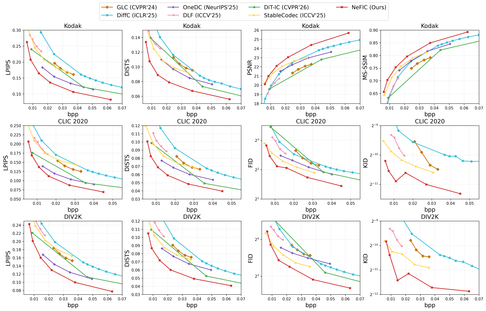

# ECCV2026-Next-Frame Decoding for Ultra-Low-Bitrate Image Compression with Video Diffusion Priors



Our inference code and checkpoints are released. If you are interested, please also check out our related works: [GLIC (CVPR 2026)](https://github.com/UnoC-727/GLIC), [CMIC (ICLR 2026)](https://github.com/UnoC-727/CMIC).


## News


## Introduction

This repository presents the official [PyTorch](https://pytorch.org/) implementation of [Next-Frame Decoding for Ultra-Low-Bitrate Image Compression with Video Diffusion Priors (ECCV 2026)](https://arxiv.org/abs/2603.15129).

NeFIC achieves ultra-low-bitrate image compression by combining a compact Anchor Codec with a one-step video diffusion generative decoder.




## Performance



> **Note:** This open-source release further improves upon the original paper results in DISTS, FID, and KID metrics.


## Environment

```bash
conda create -n nefic python=3.10
conda activate nefic
pip install -r requirements.txt
```

> **Note:** `flash-attn` and `xformers` are required for efficient attention in CogVideoX. Install `flash-attn` with `pip install flash-attn --no-build-isolation` if the default install fails.


## Pretrained Models

### Base Model

Download [CogVideoX-1.5-5B](https://huggingface.co/THUDM/CogVideoX1.5-5B) from HuggingFace:

```bash
hf download THUDM/CogVideoX1.5-5B --local-dir /path/to/CogVideoX1.5-5B-standard
```

> **Note:** The `text_encoder/` subfolder is not needed at inference if using the pre-computed `assets/prompt_embeds.pt` (included), saving ~10GB.

### NeFIC Checkpoints

Download from [HuggingFace](https://huggingface.co/yuUnuo/NeFIC):

```bash
hf download yuUnuo/NeFIC --local-dir /path/to/nefic_checkpoints
```

Each checkpoint directory contains:

```
nefic_lambda1/
├── anchor_codec.bin                    # Anchor Codec weights
└── pytorch_lora_weights.safetensors    # LoRA adapter for CogVideoX
```

We provide 6 checkpoints at different rate points:

| Lambda | Description |
|--------|-------------|
| 0.25   | Highest bitrate |
| 0.5    | |
| 1.0    | |
| 1.7    | |
| 3.0    | |
| 5.0    | Lowest bitrate |


## Usage

### Quick Start

```bash
cd inference
bash run_test.sh /path/to/checkpoint kodak
```

### Testing

```bash
# Usage: bash run_test.sh <checkpoint_dir> [dataset] [model_path] [--entropy]

# STE simulation (default, fast, estimated BPP)
bash run_test.sh /path/to/checkpoint kodak /path/to/CogVideoX1.5-5B-standard

# Real arithmetic coding (precise BPP, slightly slower)
bash run_test.sh /path/to/checkpoint kodak "" --entropy
```

Supported dataset names: `kodak`, `clic`, `div2k`, or a custom image directory path.

### Python API

```python
import torch
from nefic import NeFICCodec

# Load codec
codec = NeFICCodec.from_pretrained(
    model_path="/path/to/CogVideoX1.5-5B-standard",
    checkpoint_dir="/path/to/checkpoint",
)

# Inference
image = ...  # [1, 3, H, W] tensor in [0, 1]
with torch.no_grad():
    result = codec(image.cuda())

x_hat = result["x_hat"]         # Reconstructed image [1, 3, H, W]
anchor = result["anchor_frame"]  # Anchor reconstruction
bpp = result["bpp"]              # Bits per pixel
```

### Full Options (test.py)

| Argument | Default | Description |
|----------|---------|-------------|
| `--model_path` | — | Path to CogVideoX base model |
| `--checkpoint_dir` | — | Path to NeFIC checkpoint |
| `--input_dir` | — | Directory of test images (PNG/JPG) |
| `--output_dir` | `./nefic_results` | Output directory |
| `--dtype` | `bfloat16` | `float16` or `bfloat16` |
| `--pad_multiple` | `64` | Pad images to this multiple |
| `--with_color_fix` | `False` | AdaIN color correction (see below) |
| `--no_color_fix` | — | Disable color correction |
| `--use_entropy_coding` | `False` | Real arithmetic coding |
| `--save_intermediate` | `False` | Save anchor frame reconstructions |

### Evaluation Metrics

The test script reports: **PSNR**, **MS-SSIM**, **LPIPS**, **DISTS**, **BPP**.

For CLIC and DIV2K (>50 images), **FID** and **KID** are additionally computed via `eval_fid_kid.py`.

### Color Correction (Optional)

Following [StableCodec (arXiv:2506.21977)](https://arxiv.org/abs/2506.21977), we provide an optional AdaIN color correction via `--with_color_fix`. This is **disabled by default** as it has negligible impact on our model's output quality. Enable it with `--with_color_fix` if needed for comparison with other methods that use this post-processing step.


## Hardware Requirements

- **GPU:** NVIDIA GPU with ≥ 24GB VRAM (tested on A100 80GB)
- **Disk:** ~30GB for CogVideoX base model + ~3GB per NeFIC checkpoint


## Related Publications

* **Adaptive Learned Image Compression with Graph Neural Networks**
  
  *Yunuo Chen*, Bing He, Zezheng Lyu, Hongwei Hu, Qunshan Gu, Yuan Tian, Guo Lu
  
  *CVPR 2026* | [📄 Paper](https://arxiv.org/abs/2603.25316) | [💻 Code](https://github.com/UnoC-727/GLIC)

* **Content-Aware Mamba for Learned Image Compression**
  
  *Yunuo Chen*, Zezheng Lyu, Bing He, Hongwei Hu, Qi Wang, Yuan Tian, Li Song, Wenjun Zhang, Guo Lu
  
  *ICLR 2026* | [📄 Paper](https://openreview.net/forum?id=WwDNiisZQm) | [💻 Code](https://github.com/UnoC-727/CMIC)

* **Knowledge Distillation for Learned Image Compression**
  
  *Yunuo Chen*, Zezheng Lyu, Bing He, Ning Cao, Gang Chen, Guo Lu, Wenjun Zhang
  
  *ICCV 2025* | [📄 Paper](https://openaccess.thecvf.com/content/ICCV2025/papers/Chen_Knowledge_Distillation_for_Learned_Image_Compression_ICCV_2025_paper.pdf)

* **S2CFormer: Revisiting the RD-Latency Trade-off in Transformer-based Learned Image Compression**
  
  *Yunuo Chen*, Qian Li, Bing He, Donghui Feng, Ronghua Wu, Qi Wang, Li Song, Guo Lu, Wenjun Zhang
  
  *arXiv, 2025* | [📄 Paper](https://arxiv.org/pdf/2502.00700) | [💻 Unofficial Code](https://github.com/tokkiwa/S2CFormer)


## Contact

Feel free to reach me at [cyril-chenyn@sjtu.edu.cn](mailto:cyril-chenyn@sjtu.edu.cn) if you have any questions.


## Citation

```bibtex
@article{chen2026next,
  title={Next-frame decoding for ultra-low-bitrate image compression with video diffusion priors},
  author={Chen, Yunuo and Zhou, Chuqin and Li, Jiangchuan and Ling, Xiaoyue and He, Bing and Dai, Jincheng and Song, Li and Lu, Guo},
  journal={arXiv preprint arXiv:2603.15129},
  year={2026}
}
```


## Acknowledgement

This implementation builds upon several excellent projects:

- [CogVideo](https://github.com/zai-org/CogVideo)
- [CompressAI](https://github.com/InterDigitalInc/CompressAI)
- [MLIC](https://github.com/JiangWeibeta/MLIC)
- [RealGeneral](https://github.com/Lyne1/RealGeneral)


## License

This project is released for research purposes only.
